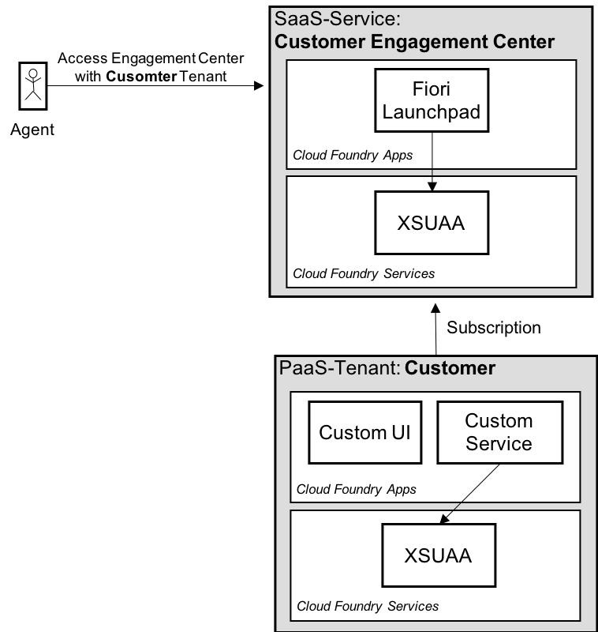

> **NOTE:** The APIs of the Agent Desktop used in this sample code are currently in rework and will be updated in the future. For more information about Agent Desktop, please follow our SAP Customer Engagement Center Administration Guide [here](https://help.sap.com/viewer/DRAFT/69ecccdd4f3a40298ad3f497d8311493/Dev/en-US/34c973ce592746489ec7f26e857ad549.html).


# Module Extensibility for Customer Engagement Center

This project includes example code that shows you how to extend the Agent Desktop with additional UIs (Work Area Views) as a module, which can communicate with an external service. The module includes two Work Area Views, one to search order data records and one to create, update, and delete an order. The Views make CRUD requests with a service (also part of this project) that offers CRUD APIs to manage the order data records.

The Agent Desktop module and the service are implemented as cloud foundry applications for SAP Cloud Platform (SCP). To run this project in the customers PaaS-tenant, they need to be deployed and some configurations need to be set. The steps are descriped in the section below.

### Prerequisites:

* Understanding of SCP CF ([SAP Cloud Platform Cloud Foundry](https://cloudplatform.sap.com/enterprise-paas/cloudfoundry.html))
* Have a SCP CF PaaS-Tenant
* Understanding of [MTA Deployment](https://help.sap.com/viewer/4505d0bdaf4948449b7f7379d24d0f0d/2.0.03/en-US/854a00eb1193486383fc4a97b998dabd.html)
* Understanding of NodeJS and SAPUI5

&nbsp;

## Setup Instructions 

This section contains step by step instructions on running this example extensibility project in your CF-PaaS customer tenant and seeing the solution in the Agent Desktop. 

Here are the steps:

1. Clone this git project locally

2. Deploy this project to your PaaS tenant as an MTA project (see mta.yaml)

3. Create a Role-Collection

    * Go to the SCP Cockpit of your customer PasS tenant

    * Go to "Security" > "Role Collections"

    * Select "New Role Collection" and give it any name of your choosing

    * Add the Role "Admin" from the "module_ext..." XSUAA to your Role Collection

      > Copy the **Application Identification** ID of this XSUAA for the next configuration step. The ID can just be found after the first deployment from previous step.

    * Assign this Role Collection to an existing user account

4. Open the MTA deployment file (mta.yaml) and change the following placeholders

    * \<client-id-of-cec-xsuaa\> with the **Application Identification** ID of XSUAA (from previous step).
    * \<id-of-customer-subaccount\> with the Subaccount ID that can be taken from the Cockpit. Go to Overview and you will see the ID in the **Subaccount Details** area.

5. Redeploy the MTA with the new configuration.

6. Configure the destinations for the custom UI and custom service

    * Go to the SCP Cockpit of your customer PasS tenant

    * Expand "Connectivity" and go to "Destinations"

    * Select "New Destination" to create a destination for each app

      ``````
      Name: Use the name "module_ext-ui" for the custom UI and "module_ext-service" for the custom service
    
      Type: HTTP
    
      URL: Use the routes created in the deployment process. You can find them in the Cockpit. Go to Spaces > Choose a space > Applications > Choose the respective app > Application Routes.
    
      Proxy Type: Internet
    
      Authentication: The module_ext-ui destination uses the basic authentication method with the name = "john" and password = "secret" as credentials. The module_ext-service destination does not take any authentication method.
    
      Additional Properties: Include for both destinations a property with the key "sap.ec.proxy.enable" and value "true".
      ``````

7. Configure the Agent Destop Module with the following values.

    > **Note:** the values with << ... >> need to be replaced.

    * *Modules Configuration*

      ```
      Active: Yes
      Name: Module_Template_App
      Description: Engagement Context Extension Module Template
      Resource Location: ./scc/module_ext-ui/
      Resource Name: com.sap.ec.moduletemplate
      ```

      * *Views (WorkAreaViewSearch)*

        ```
        Name: WorkAreaViewSearch_Template
        View Technology: XML_VIEW
        View Type: WAV
        Resource Name: com.sap.ec.moduletemplate.view.WAVSearch
        ```

      * *View Properties (WorkAreaViewSearch)*

        ```
        Active: Yes
        Key: DISPLAY_ICON
        Value: sap-icon://create

        Active: Yes
        Key: CLOSABLE
        Value: true

        Active: Yes
        Key: ONE_INSTANCE_ONLY
        Value: true
        ```

      * *Views (WorkAreaViewDetail)*

        ```
        Name: WorkAreaViewDetail_Template
        View Technology: XML_VIEW
        View Type: WAV
        Resource Name: com.sap.ec.moduletemplate.view.WAVDetail
        ```

      * *View Properties (WorkAreaViewDetail)*

        ```
        Active: Yes
        Key: DISPLAY_ICON
        Value: sap-icon://create

        Active: Yes
        Key: CLOSABLE
        Value: true

        Active: Yes
        Key: ONE_INSTANCE_ONLY
        Value: false
        ```

      * *Views (ActionAreaView_Template)*

        ```
        Name: ActionAreaView_Template
        View Technology: XML_VIEW
        View Type: AAV
        Resource Name: com.sap.ec.moduletemplate.view.AAV
        ```

      * *View Properties (ActionAreaView_Template)*

        ```
        Active: Yes
        Key: DISPLAY_ORDER
        Value: << Next free one >>

        Active: Yes
        Key: CREATELINK_ACTIVE
        Value: true
        ```

    * *Business Objects*

      ``````
      Name: Module_Template_BDT
      Description: Module Template - Business Object
      ``````

      * *Business Object Properties*

        ```
        Active: Yes
        Name: TEXT_ID_SINGULAR
        Value: BUSDOCTYPE_MODULETEMPLATE
        Description: i18n text id - singular

        Active: Yes
        Name: TEXT_ID_PLURAL
        Value: BUSDOCTYPE_MODULETEMPLATE
        Description: i18n text id - plural

        Active: Yes
        Name: INTERACTION_LOG_RELEVANT
        Value: true
        Description: Is Interaction log relevant	

        Active: Yes
        Name: ITEM_HANDLER_CLASS
        Value: com.sap.ec.moduletemplate.helper.bcdhelper
        Description: Item handler class
        ```

    

    * *Navigation configuration*
    
      ``````
      Active: Yes
      Business Object: Module_Template_BDT
      Action: DEFAULT
      View: ActionAreaView_Template
      Navigation Area: AA

      Active: Yes
      Business Object: Module_Template_BDT
      Action: SEARCH
      View: WorkAreaViewSearch_Template
      Navigation Area: WA
      
      Active: Yes
      Business Object: Module_Template_BDT
      Action: CREATE
      View: WorkAreaViewDetail_Template
      Navigation Area: WA
      
      Active: Yes
      Business Object: Module_Template_BDT
      Action: EDIT
      View: WorkAreaViewDetail_Template
      Navigation Area: WA
      
      Active: Yes
      Business Object: Module_Template_BDT
      Action: DISPLAY
      View: WorkAreaViewDetail_Template
      Navigation Area: WA
      ``````


After going through these steps, you will see the Action Area with the title **Order (Customer Module)**. Log in with the user account which has the Role Collection assigned to it, open the Agent Desktop app and you will see the new view.

&nbsp;

## Project Construction

In this section you can find information on the artifacts included in this example extensibility project and how it works. It includes information about the involved applications, the communication between UI and Service apps, and how the security layers work.

### CF apps and CF services

This project contains:  

- An application (called Custom UI) that contains SAPUI5 artifacts to extend Agent Desktop. The artifacts are UIs to search, create, update, and delete order data records (which is done by sending requests to the Custom Service application). This application is protected with Basic Authentication.
- An application (called Custom Service) that offers an orders service with a CRUD Rest API. This application is protected with an authorization layer. This layer is based on the solution of [XSUAA Service](https://help.sap.com/viewer/65de2977205c403bbc107264b8eccf4b/Cloud/en-US/ea0281368f11472b8d2b145a2a28666c.html).
- An XSUAA Cloud Foundry service instance will be created automatically after deploying this project. This happens with the help of the deployment definition (mta.yaml). The defintion also includes also the scopes and roles that are used to build the Access Control List (ACL) for the custom service.

Both applications are based on NodeJS and are already prepared to be deployed on Cloud Foundry.

> INFO: You can protect both applications with the same security layer. More information below.

&nbsp;



&nbsp;

In the block diagram you can see the CF apps and  CF services that are involved in this extensibility soltuion.

The Fiori Launchpad, which includes the Agent Desktop application, is deployed on the *Customer Engagement Center* tenant. When the Agent client runs the URL to the Fiori launchpad, then a redirection to a log in page opens in the browser. This log in page comes from the XSUAA of the same tenant. After logging in, the client will be redirected back to the Fiori launchpad. The launchpad manages this with an access token from this client for authentication and authorization purposes.

In the customer tenant we see the deployed cf-apps and cf-services from this project. When a client opens the Agent Desktop in a browser then the Agent Desktop intially loads the configured modules (including the Custom UI) and presents it to the client. When the client opens a Work Area View of the Custom UI to read or write an order data record, then a request will created for the custom service. This request doesn't go directly from browser to custom UI/service apps, because then the security layers respond with an unauthenticated/unauthorized error. Instead the request first goes to Fiori launchpad and then it is forwarded to the Custom UI/Service.

### Security Layers

The custom UI and the custom service use different security layers. Each of them has its advantage and disadvantage.

The custom service is bound to the XSUAA instance of the customer tenant to be able to authorize incoming requests. An incoming request that is forwarded by Fiori launchpad includes an access-token created during the client log in process by the *Customer Engagement Center* XSUAA. This token will be exchanged with a new one by the XSUAA from the customer tenant, so the custom service is able to authorize the request with the scopes and roles defined by the customer.

The custom UI is just protected with authentication (basic authentication), which means that a client doesn't need any special permissions assigned to it. A client only needs to be logged in to reach the UI artifacts. The credentials are taken from the destination configuration during the forwarding process in Fiori launchpad.

The following points need to be considered when choosing a security layer for your application:

* Is authorization required? —> Then use the security layer like in Custom Service application
* Is authentication enough and performance is important? —> Then use the basic authentication solution like in the custom UI application. Here the performance is better because there is no need to exchange an access token with XSUAA.

&nbsp;

## Further Information

You can find more information in the Administration Guide for SAP Customer Engagement Center on the [SAP Help Portal](https://help.sap.com/viewer/p/SAP_CUSTOMER_ENGAGEMENT_CENTER).

&nbsp;

# License

Copyright (c) 2019 SAP SE or an SAP affiliate company. All rights reserved.

This file is licensed under the SAP Sample Code License except as noted otherwise in the [LICENSE file](LICENSE).